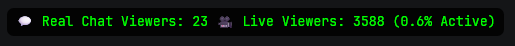

# 🔍 Kick Real Chat Viewers - (Chrome, Brave, Edge, Firefox) Extension

Track the **real number of unique chatters** in a Kick live stream in real time, and compare it to the official viewer count. Perfect for spotting active chats, lurking ratios, or engagement drops!


---

## 📦 Features

- ✅ Count unique chat users who send a message
- ✅ Live chat view ratio compared to official viewers
- ✅ Automatically resets when switching streams
- ✅ Smart overlay with percentage active
- ✅ Movable floating panel — drag it anywhere on the screen!

---

## 🛠️ Installation

1. **Download the Extension:**
   - Clone this repo or extract the `.zip` if downloaded.

2. **Load into (Chrome, Brave, Edge, Firefox):**
   - Go to `(chrome|edge|firefox|edge)://extensions/` (depend on your browser)
   - Enable **Developer Mode** (top right)
   - Click **Load unpacked**
   - Select the folder (folder of project) that contains:
     ```
     manifest.json
     content.js
     icon.png
     ```

3. **Done!**
   - Visit any **Kick.com live stream**
   - You'll see the overlay in the top-right (or wherever you drag it)

---

## 💬 How It Works

- The script observes chat messages inside the DOM.
- Every time a unique user sends a message, they are counted.
- The current **official viewer number** is also scraped and decoded from animated digits.
- A floating overlay displays:



## 🧠 Credits

Made with ❤️ by [AbdullahSaidAbdeaaziz](https://www.github.com/AbdullahSaidAbdeaaziz).

## 📜 License

MIT License. Free to use, modify, and improve.